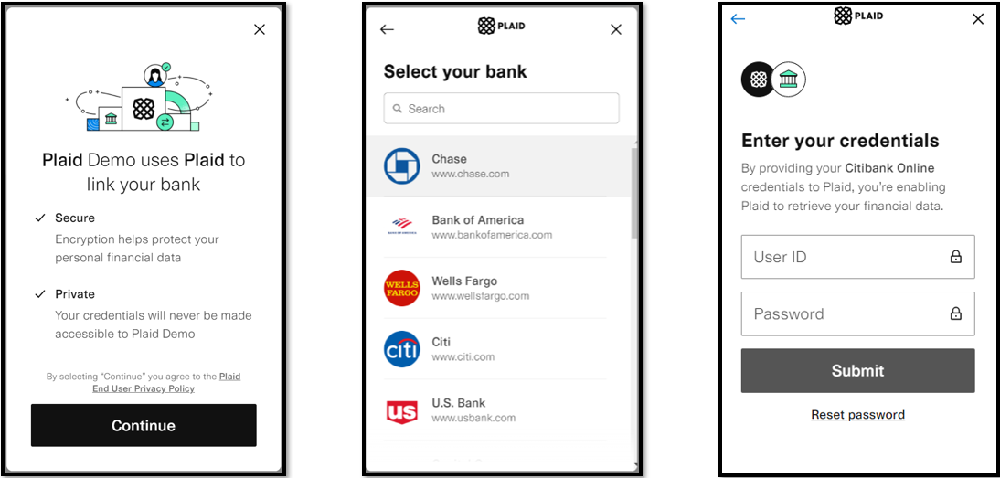

# ACH Services

## ACH Validation

As part of the security measures, the validation of bank account is a required process before processing an ACH transaction. This validation is through Plaid, a third-party service that allows the client to instantly connect their financial account through different options. 

The account validation process through Plaid Link is required for all customers who use a bank account that has not been previously validated. For accounts already validated, this process will not be necessary.

There are several types of bank account validation through the Plaid Link:

1. Instant Auth (credential-based) - Flow by default and is verified instantly.
2. Instant Match (Account and routing number based) - Alternate flow when instant auth is not available. Plaid will ask the user to enter their account number and routing number.
3. Automated Micro-Deposits - Plaid will make a micro-deposit and then automatically verify within one to two business days.
4. Same-Day Micro-Deposits – Plaid will make two deposits that will be posted within one business day. Customers are then instructed to manually verify deposited amount within one business day.

-The types of bank account validation depend on the affiliation of the financial institution to Plaid.
 
-The minimum browser requirements for Plaid Link: Internet Explorer 11.

#### ProcessACH

The merchant must handle the response and implementation of the "Plaid Link" verification screen. This can be accessed through a URL and will be provided as part of the response message.
The ACH validation response message will be through an ACH sale using <b>ProcessACH</b>. As long as the client's ACH account has not had a previous validation.

#### Response message: ProcessACH

 | **Parameter** | **Type** | **Description** | 
 | :------------ | :------ | :-------------- | 
 | rCode | string | Transaction response code. See [Response Codes](../responseCodes). | 
 | rMsg | string | "Plaid Link" URL. | 

 *This response is only for <b>ProcessACH</b>.

## ACH Return

This additional service is optional in the configuration of the Web Payments Service. It is an agreement between the merchant and the Bank. The service consists in generating a report with returned ACH transactions. Additionally, the completed transactions file features a layout that includes returned transactions.

## ACH Verification Service

This additional service is optional in the configuration of the Web Payments Service. To use this service, the merchant must define a formula that will be used to reject ACH payments. This service searches a Returned ACH Transactions database that contains transactions returned for different reasons at different dates. The merchant’s formula must define quantity of occurrences, frequency and return code. An ACH payment will be rejected if it satisfies the formula.

## ACH Local Bank Service

This additional service is optional in the configuration of the Web Payments Service. This service is used for merchants who do not wish to allow clients to make ACH payments with foreign bank accounts. Once the service is activated for the merchant, every time an ACH transaction is attempted, the associated account will be verified. In case of a negative response, the transaction will be declined.

## ACH BPPR Hold Service[^1]

This additional service is optional in the configuration of the Web Payments Service. This service may be used if the merchant wishes to validate ACH payments made with BPPR accounts. When a client makes a payment with a BPPR account, the transaction amount is put on hold, guaranteeing that the transaction will not be returned for insufficient funds. If the account does not have sufficient funds, the transaction will be declined.

[^1]: This service is only available for Banco Popular's merchants.